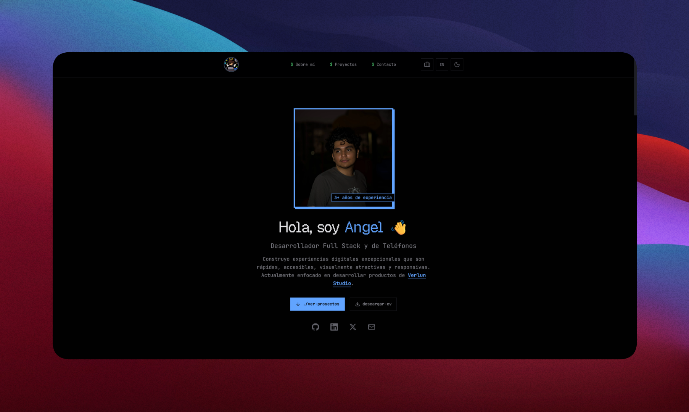

<div align="center">



### Portafolio bilingüe (ES/EN) con dos diseños intercambiables desde la misma URL

[](https://astro.build/)
[](https://reactjs.org/)
[](https://tailwindcss.com/)
[](https://www.typescriptlang.org/)
[](https://greensock.com/gsap/)
[](LICENSE)

**[Ver demo](https://angel-website-pi.vercel.app)**&nbsp;•&nbsp;**[Changelog](CHANGELOG.md)**&nbsp;•&nbsp;**[Guía de contribución](CONTRIBUTING.md)**

</div>

---

## Qué es

Es el sitio personal de Angel De La Torre: presenta quién es, qué proyectos ha
construido y cómo contactarlo, en español e inglés. No es una plantilla
genérica de portafolio ni un CMS — cada dato de negocio, proyecto y
certificado vive en el propio repositorio y se resuelve en build time, sin
backend propio salvo el envío del formulario de contacto.

- **Dos diseños sobre el mismo HTML**: `src/libs/design.ts` decide entre
  TERMINAL (`/`, pixel-art) y FORMAL (`/formal`, clásico) según la ruta;
  `<html data-design>` conmuta el skin.
- **Una sola fuente de traducciones**: `src/i18n/ui.ts` guarda cada texto una
  vez, anidado por `{ es, en }` y/o `{ TERMINAL, FORMAL }`, resuelto por un
  único `translate()` recursivo.
- **Un único objeto de configuración**: `src/config/site.ts` (`SITE`)
  concentra contacto, redes, servicios, FAQ y todos los valores por defecto de
  SEO.
- **Contenido versionado, no editado en un panel**: proyectos y certificados
  son Content Collections (`src/content/projects/{es,en}/*.md`,
  `src/content/certificates/{es,en}/*.yml`).

## Stack

Construido con [Astro](https://astro.build/) en modo `output: "static"`, con
[React](https://reactjs.org/) solo en las islas que necesitan estado (el
formulario de contacto, los toggles de tema/idioma/diseño) y
[TypeScript](https://www.typescriptlang.org/) en todo el proyecto. Los
estilos son [Tailwind CSS](https://tailwindcss.com/) vía `@tailwindcss/vite`,
las animaciones usan [GSAP](https://greensock.com/gsap/), el formulario se
valida con [react-hook-form](https://react-hook-form.com/) y envía los correos
con [Resend](https://resend.com/) desde una Astro Action, y las imágenes se
optimizan en build con [Sharp](https://sharp.pixelplumbing.com/). La decisión
que define el proyecto: cero backend propio — todo el sitio se genera
estático y se despliega en [Vercel](https://vercel.com/) con
`@astrojs/vercel`, así que cualquier dato nuevo (un proyecto, una traducción,
un valor de `SITE`) exige un build, no una llamada a una API.

## Empezar

Requisitos:

- **Node.js** ≥ 24.19.0
- **pnpm** ≥ 11.17.0 (el repo fija `pnpm@11.24.0` vía `packageManager`)

```bash
git clone https://github.com/iangelmanuel/angel-website.git
cd angel-website
cp .env.template .env   # añade tu RESEND_API_KEY
pnpm install
pnpm dev
```

El sitio queda disponible en `http://localhost:4321`.

| Comando               | Qué hace                                  |
| --------------------- | ----------------------------------------- |
| `pnpm dev`            | Servidor de desarrollo                    |
| `pnpm build`          | Build de producción (estático) en `dist/` |
| `pnpm preview`        | Sirve el build de producción localmente   |
| `pnpm check`          | `astro check`: tipos y archivos `.astro`  |
| `pnpm sync`           | Sincroniza los tipos generados de Astro   |
| `pnpm eslint`         | Lint sobre todo el proyecto               |
| `pnpm prettier`       | Formatea el código                        |
| `pnpm prettier:check` | Verifica el formateo sin escribir         |

CI (`.github/workflows/ci.yml`) corre `check`, `eslint` y `prettier:check` en
paralelo, y un build, en cada push/PR a `main`.

## Añadir un proyecto

La tarea que más se repite en este repo: documentar un proyecto nuevo. Crea un
archivo por idioma con la misma imagen y el mismo esquema
(`src/content.config.ts`):

```yaml
# src/content/projects/es/mi-proyecto.md
---
title: "Mi Proyecto"
description: "Qué resuelve, en una frase."
publishDate: 2026-09-07
technologies: ["Astro", "TypeScript"]
githubUrl:
  { url: "https://github.com/iangelmanuel/mi-proyecto", isPrivate: false }
liveUrl: "https://mi-proyecto.vercel.app"
image: "../../assets/projects/mi-proyecto.webp"
featured: true
status: "completed" # completed | in-progress | planned | paused | beta
---
Cuerpo en Markdown con el detalle del proyecto.
```

Repite el mismo archivo en `src/content/projects/en/`, coloca la imagen en
`src/content/assets/projects/` y `pnpm dev` la recoge sin tocar código.

## Licencias

- Código bajo licencia MIT — ver [LICENSE](LICENSE).
- Tipografías (Geist Pixel, JetBrains Mono, Nunito) bajo licencia SIL Open
  Font License.

## Autor

**Angel De La Torre**

- GitHub: [@iangelmanuel](https://github.com/iangelmanuel)
- LinkedIn: [@iangelmanuel](https://www.linkedin.com/in/iangelmanuel)
- X: [@iangelmanuel](https://x.com/iangelmanuel)
- Website: [angeldm.dev](https://angel-website-pi.vercel.app)

---

<div align="center">

Si te sirvió algo de este repo, deja una estrella ⭐

Hecho por Angel DM

</div>
