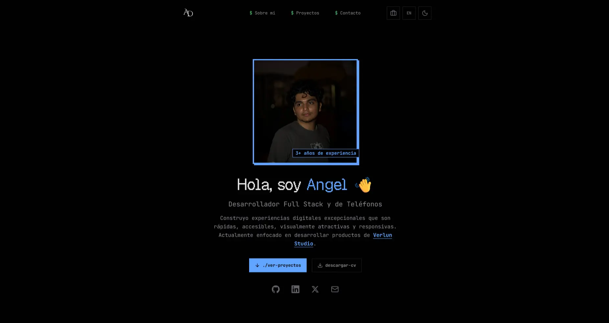

# 🌟 Angel De La Torre — Portfolio Website

<div align="center">




**Portafolio personal bilingüe con dos diseños intercambiables, construido con Astro, React y Tailwind CSS**

[](https://astro.build/)
[](https://reactjs.org/)
[](https://tailwindcss.com/)
[](https://www.typescriptlang.org/)
[](https://greensock.com/gsap/)

[🌐 Ver Demo](https://angel-website-pi.vercel.app) • [📧 Contacto](mailto:iangelmanuel02@gmail.com) • [💼 LinkedIn](https://www.linkedin.com/in/iangelmanuel)

</div>

---

## 🚀 Características Principales

- 🖥️ **Doble Diseño**: TERMINAL (pixel-art / terminal, diseño principal en `/`) y FORMAL (presentación clásica en `/formal`), intercambiables desde la misma URL
- 🌓 **Tema Claro/Oscuro**: Persistencia en `localStorage` y sincronización durante la navegación con Astro transitions (`astro:after-swap`)
- 🌍 **Multiidioma**: Español e inglés vía `i18n` nativo de Astro (`/` = ES por defecto, `/en` = EN), con un único árbol de traducciones (`src/i18n/ui.ts`) resuelto según idioma y diseño
- 📱 **Totalmente Responsive**: Mobile-first con los breakpoints estándar de Tailwind CSS v4
- ⚡ **Rendimiento Óptimo**: Salida 100% estática (`output: "static"`) desplegada en el adaptador de Vercel
- 🎨 **Animaciones Fluidas**: Transiciones con GSAP y microinteracciones en CSS
- 🔍 **SEO Completo**: `<BaseHead>` centralizado, JSON-LD (`Organization`, `WebSite`, `ProfessionalService`, `Service`, `FAQPage`), `robots.txt`, `sitemap.xml` y `manifest.webmanifest` generados desde una única fuente de datos (`SITE`)
- 🎓 **Content Collections**: Proyectos y certificados gestionados con Astro Content Collections (Markdown + YAML), en español e inglés
- 📧 **Formulario de Contacto**: Astro Actions + `react-hook-form` en el cliente, envío de emails vía Resend API
- 🧩 **Configuración Centralizada**: `src/config/site.ts` (`SITE`) es la única fuente de verdad de datos de negocio, contacto, redes, servicios, FAQ y valores SEO

## 🛠️ Stack Tecnológico

### Frontend Framework

- **[Astro 7.2.9](https://astro.build/)** — Framework web, salida estática con adaptador Vercel
- **[React 19.2.8](https://reactjs.org/)** — Componentes interactivos (islas): formulario de contacto, toggles
- **[TypeScript 6.0.3](https://www.typescriptlang.org/)** — Tipado estático (fijado en `6.x`; el compilador nativo de `7.x` aún no expone la API que usa `@astrojs/language-server`)

### Styling & UI

- **[Tailwind CSS 4.3.3](https://tailwindcss.com/)** — Utility-first, vía `@tailwindcss/vite`
- **[astro-icon](https://www.npmjs.com/package/astro-icon)** — Iconografía SVG (logos, redes sociales)
- **[Lucide React](https://lucide.dev/)** — Iconos en componentes React
- **[Sonner](https://sonner.emilkowal.ski/)** — Notificaciones toast

### Animations & Forms

- **[GSAP 3.15.0](https://greensock.com/gsap/)** — Animaciones
- **[react-hook-form](https://react-hook-form.com/)** — Validación y estado del formulario de contacto
- **[Resend](https://resend.com/)** — Envío de emails desde una Astro Action

### Images & Media

- **[Sharp](https://sharp.pixelplumbing.com/)** — Optimización de imágenes en build (requiere `sharp: true` en `pnpm-workspace.yaml` → `onlyBuiltDependencies`/`allowBuilds`)

### Development Tools

- **[pnpm](https://pnpm.io/)** — Gestor de paquetes (versión fijada en `packageManager`)
- **[ESLint](https://eslint.org/)** — `@eslint/js` + `typescript-eslint` + `eslint-plugin-astro`, con `no-explicit-any` y `no-unused-vars` como error
- **[Prettier](https://prettier.io/)** — Formateo automático, con plugins para Astro y orden de clases Tailwind

## 📁 Estructura del Proyecto

```
angel-website/
├── 📂 .github/workflows/         # CI (lint, typecheck, prettier, build)
├── 📂 public/                    # Archivos estáticos servidos tal cual
│   ├── 📂 docs/                  # CVs descargables (ES/EN)
│   ├── 📂 img/                   # Imágenes: perfil, proyectos, certificados, academias
│   └── 📂 fonts/                 # Geist Pixel (diseño TERMINAL) y Nunito (diseño FORMAL)
├── 📂 src/
│   ├── 📂 actions/                # Astro Actions (envío de email de contacto)
│   ├── 📂 components/
│   │   ├── 📂 seo/                # BaseHead, JsonLd, PreloadFont, ThemeScript
│   │   ├── 📂 shared/              # TopMenu, AsideMobileMenu, Footer, MainContent
│   │   ├── 📂 ui/                  # sonner (único wrapper de UI restante)
│   │   ├── DesignToggle.astro      # Alterna entre diseño TERMINAL y FORMAL
│   │   ├── ModeToggle.tsx          # Alterna tema claro/oscuro
│   │   └── ToggleLanguage.astro    # Alterna idioma ES/EN
│   ├── 📂 config/
│   │   └── site.ts                 # SITE: fuente única de datos de negocio, contacto y SEO
│   ├── 📂 const/                   # routes.ts (rutas por diseño), form-config.ts
│   ├── 📂 content/                 # Content Collections
│   │   ├── 📂 assets/projects/     # Screenshots de proyectos
│   │   ├── 📂 certificates/{es,en}/ # Certificados (YAML)
│   │   └── 📂 projects/{es,en}/     # Proyectos (Markdown)
│   ├── content.config.ts           # Definición de colecciones y esquemas
│   ├── 📂 hooks/                   # use-contact-form.ts
│   ├── 📂 i18n/
│   │   ├── ui.ts                   # Todas las traducciones, anidadas por { es, en } y/o { TERMINAL, FORMAL }
│   │   └── index.ts                # useI18n(Astro) → { t, lang, design }
│   ├── 📂 icons/                   # SVGs de marca (GitHub, LinkedIn, X, logos)
│   ├── 📂 layouts/
│   │   └── Layout.astro            # Layout compartido por ambos diseños
│   ├── 📂 libs/                    # design.ts, alternate-url.ts, seo.ts, date-formatter.ts, ...
│   ├── 📂 modules/portfolio/       # Módulo único con todo el UI del portafolio
│   │   ├── 📂 components/          # Project, CertificateCard, ContactForm
│   │   ├── 📂 sections/            # home-page/ (Hero, About, Projects, Contact) y certificates/
│   │   ├── 📂 libs/                # card-accent.ts (colores rotativos por card)
│   │   └── 📂 styles/              # portfolio.css (tokens/base compartidos), terminal.css, formal.css
│   ├── 📂 pages/
│   │   ├── 📂 [...route]/          # index.astro y certificates.astro generan las 12 rutas (idioma × diseño)
│   │   ├── robots.txt.ts
│   │   ├── sitemap.xml.ts
│   │   └── manifest.webmanifest.ts
│   └── 📂 types/                   # i18n.d.ts, contact-form-data.d.ts, navigation.d.ts
├── astro.config.mjs
├── eslint.config.mjs
├── tsconfig.json
├── package.json
├── pnpm-workspace.yaml
├── CHANGELOG.md
└── README.md
```

## 🎨 Sistema de Diseño

El sitio no tiene un único look: la ruta decide qué diseño se renderiza sobre el mismo árbol HTML.

| Diseño       | Rutas                             | Estética                                                                 | Tipografía                             |
| ------------ | --------------------------------- | ------------------------------------------------------------------------ | -------------------------------------- |
| **TERMINAL** | `/`, `/certificates`              | Pixel-art / terminal, superficies sin bordes redondeados, tokens `oklch` | Geist Pixel (títulos) + JetBrains Mono |
| **FORMAL**   | `/formal`, `/formal/certificates` | Presentación clásica, tarjetas con bordes redondeados                    | Nunito                                 |

- `src/libs/design.ts` resuelve el diseño activo (`getDesign(url)`) a partir del path.
- `<html data-design="...">` conmuta el skin; `styles/terminal.css` y `styles/formal.css` cargan solo lo específico de cada uno sobre la base compartida en `styles/portfolio.css`.
- `<DesignToggle>` enlaza a la URL equivalente en el otro diseño (`getAlternateDesignUrl`), preservando idioma y sección.
- Cada tarjeta de proyecto/certificado recibe un color de acento rotativo (`getCardAccent()`).

### 🎭 Tema Claro/Oscuro

- Se aplica antes del render (`<ThemeScript>` inline) para evitar FOUC.
- Persiste en `localStorage('theme')`, con `prefers-color-scheme` como fallback.
- Se resincroniza en cada navegación de Astro (`astro:after-swap`), ya que el sitio es multipágina.

## 🌐 Internacionalización (i18n)

Traducciones centralizadas en un único árbol, sin duplicar archivos por idioma:

```typescript
// src/i18n/ui.ts
export const ui = {
  hero: {
    greeting: { es: "Hola, soy ", en: "Hi, I'm " },
    primaryBtn: {
      TERMINAL: { es: "./ver-proyectos", en: "./view-projects" },
      FORMAL: { es: "Ver mi trabajo", en: "View my work" }
    }
  }
  // ...
}
```

Un único resolver recursivo (`translate()` en `src/i18n/index.ts`) recorre el árbol y elige la rama `{ es, en }` y/o `{ TERMINAL, FORMAL }` según corresponda, sin importar cuántos niveles de anidación tenga. Cada página/sección obtiene lo que necesita con un solo hook:

```typescript
const { t, lang, design } = useI18n(Astro)
```

## 🚀 Instalación y Desarrollo

### Prerrequisitos

- **Node.js** ≥ 24.19.0
- **pnpm** ≥ 11.17.0 (el repo fija `pnpm@11.24.0` vía `packageManager`; usa Corepack o instala esa versión exacta)

### Configuración Inicial

1. **Clonar el repositorio**

   ```bash
   git clone https://github.com/iangelmanuel/angel-website.git
   cd angel-website
   ```

2. **Configurar variables de entorno**

   ```bash
   cp .env.template .env
   ```

   Variable requerida (formulario de contacto):

   ```bash
   RESEND_API_KEY="your_resend_api_key_here"
   ```

3. **Instalar dependencias**

   ```bash
   pnpm install
   ```

4. **Iniciar servidor de desarrollo**

   ```bash
   pnpm dev
   ```

5. **Abrir en el navegador**

   ```
   http://localhost:4321
   ```

### 🔧 Scripts Disponibles

| Comando               | Descripción                                        |
| --------------------- | -------------------------------------------------- |
| `pnpm dev`            | Inicia el servidor de desarrollo                   |
| `pnpm build`          | Construye la versión de producción (estática)      |
| `pnpm preview`        | Previsualiza el build de producción                |
| `pnpm check`          | Verifica tipos y archivos `.astro` (`astro check`) |
| `pnpm sync`           | Sincroniza los tipos generados de Astro            |
| `pnpm eslint`         | Ejecuta ESLint sobre todo el proyecto              |
| `pnpm prettier`       | Formatea el código con Prettier                    |
| `pnpm prettier:check` | Verifica el formateo sin escribir cambios          |

CI (`.github/workflows/ci.yml`) ejecuta `check`, `eslint` y `prettier:check` en paralelo, y luego `build`, en cada push/PR a `main`.

## 🎨 Personalización

### Datos del sitio, contacto y SEO

Todo lo que no es contenido de proyectos/certificados vive en un único archivo: `src/config/site.ts` (objeto `SITE`). Ahí se edita: nombre, descripción, ubicación, contacto, redes sociales, servicios, FAQ, horario de atención, páginas legales, navegación y todos los valores por defecto de SEO (título, keywords, Open Graph, Twitter Card, geo, `themeColor`).

### Colores del Tema

Tokens definidos en `src/modules/portfolio/styles/portfolio.css` (compartidos) y ajustados por diseño en `terminal.css` / `formal.css`, usando `oklch()`.

### Contenido Personal

1. **Textos e idiomas**: edita `src/i18n/ui.ts`
2. **Imágenes**: reemplaza archivos en `public/img/`
3. **Proyectos**: añade/edita archivos en `src/content/projects/{es,en}/`
4. **Certificados**: añade/edita archivos en `src/content/certificates/{es,en}/`
5. **CV**: reemplaza los PDFs en `public/docs/` (`cv-angel-dm.pdf` para ES, `cv-angel-dm-en.pdf` para EN)

### Gestión de Contenido

Astro Content Collections (`src/content.config.ts`) gestiona:

- **Proyectos**: Markdown en `src/content/projects/{es,en}/`, con imágenes en `src/content/assets/projects/` optimizadas vía `<Image />`
- **Certificados**: YAML en `src/content/certificates/{es,en}/`

Cada colección soporta español e inglés de forma independiente.

## 🔍 SEO

- `<BaseHead>` centraliza `<title>`, meta description, canonical, robots, Open Graph y Twitter Card, con fallback a `SITE.seo`.
- `<JsonLd>` inyecta structured data (`Organization`, `WebSite`, `ProfessionalService`, `Service`, `FAQPage`) por idioma, generado desde `SITE` vía `src/libs/seo.ts`.
- `robots.txt`, `sitemap.xml` y `manifest.webmanifest` se generan como rutas (`src/pages/*.ts`) a partir de `SITE`, sin archivos estáticos que mantener a mano.

## 🚢 Despliegue

Desplegado en **[Vercel](https://vercel.com/)** con `@astrojs/vercel` (salida estática, Web Analytics activado). Compatible con cualquier host de archivos estáticos.

```bash
pnpm build
```

El sitio se genera en `dist/`, listo para desplegar.

## 🤝 Contribución

Las contribuciones son bienvenidas. Para cambios importantes:

1. **Fork** el repositorio
2. **Crea** una rama para tu feature (`git checkout -b feature/AmazingFeature`)
3. **Commit** tus cambios (`git commit -m 'Add some AmazingFeature'`)
4. **Push** a la rama (`git push origin feature/AmazingFeature`)
5. **Abre** un Pull Request

### Guidelines de Contribución

- Sigue las convenciones de código existentes
- Ejecuta `pnpm eslint`, `pnpm prettier:check` y `pnpm check` antes de hacer commit
- Documenta los cambios relevantes en `CHANGELOG.md`
- Prueba en ambos diseños (TERMINAL y FORMAL) y ambos idiomas (ES/EN)

## 📄 Licencia

Este proyecto está bajo la licencia MIT. Ver el archivo [LICENSE](LICENSE) para más detalles.

## 👨‍💻 Autor

**Angel De La Torre**

- 🌐 Website: [angel-website-pi.vercel.app](https://angel-website-pi.vercel.app)
- 💼 LinkedIn: [@iangelmanuel](https://www.linkedin.com/in/iangelmanuel)
- 🐙 GitHub: [@iangelmanuel](https://github.com/iangelmanuel)
- 📧 Email: [iangelmanuel02@gmail.com](mailto:iangelmanuel02@gmail.com)

---

<div align="center">

**⭐ Si te gusta este proyecto, no olvides darle una estrella ⭐**

_Hecho con ❤️ y mucho ☕ por Angel DM_

</div>
