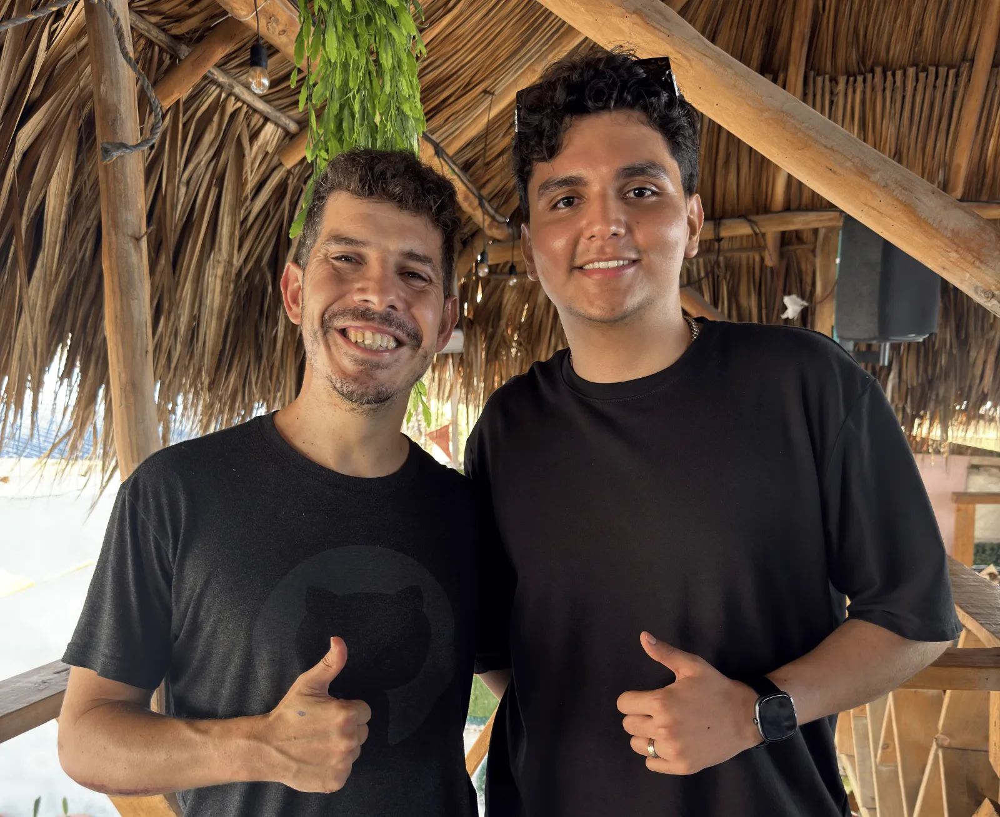
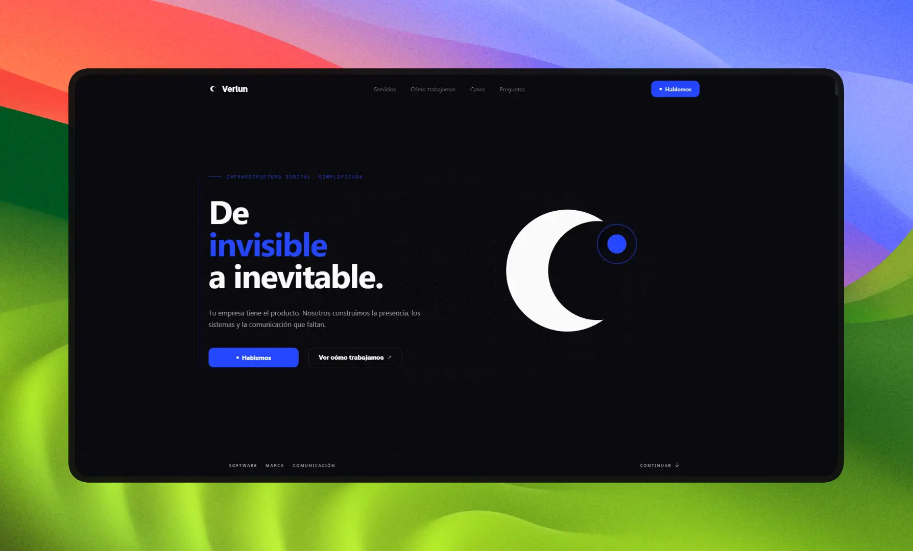
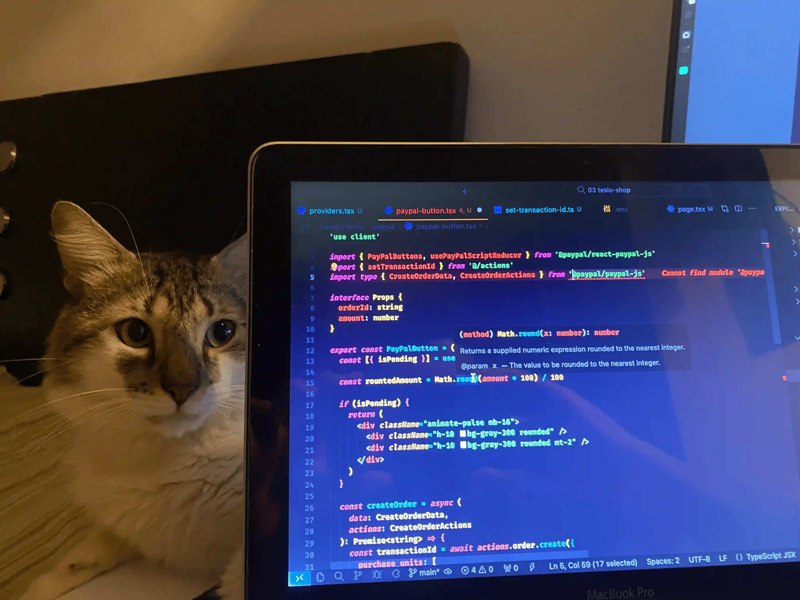

Durante mucho tiempo pensé que estudiar Negocios y Finanzas Internacionales y dedicarme al desarrollo de software eran dos caminos completamente diferentes. Mientras avanzaba en mi carrera, también comenzaba a descubrir una pasión que llevaba conmigo desde mucho antes: crear cosas mediante código. Por momentos llegué a preguntarme si en algún punto tendría que escoger entre una profesión y la otra, especialmente porque no estaba estudiando una carrera relacionada directamente con tecnología. Hoy, mientras estoy cerca de terminar mi carrera, trabajo desarrollando software, construyo soluciones para empresas, exploro inteligencia artificial y sigo aprendiendo constantemente, puedo decir que ya no veo esos dos mundos como caminos separados. De hecho, **una de las cosas que más valor le encuentro a mi recorrido es precisamente haber aprendido a combinarlos**.

## Antes del código

En 2021 comencé a estudiar Negocios y Finanzas Internacionales en la [Universidad Autónoma del Caribe](https://www.uac.edu.co). La elección tenía bastante sentido para mí porque desde hacía tiempo me llamaban la atención los mercados financieros, la bolsa de valores, las inversiones y, en general, todo lo relacionado con entender cómo funcionan los negocios. Siempre me han gustado los números y durante la carrera encontré especial interés en temas como las tasas de interés, el interés simple y compuesto, las tablas de amortización, el análisis de datos de una empresa, el comercio exterior, el marketing y la gerencia. También fui descubriendo las áreas que disfrutaba menos; la parte legal nunca fue de mis favoritas, mientras que analizar información, entender cómo funciona una empresa y pensar en la manera en que puede crecer o mejorar siempre despertó mucho más mi curiosidad.

Mi carrera no fue un camino completamente lineal. Comencé durante la pandemia y tuve que estudiar virtualmente durante un semestre. Posteriormente tuve que hacer una pausa de otro semestre por cuestiones familiares y finalmente retomé mis estudios. Ahora, en 2026, estoy cerca de completar ese ciclo y graduarme. Al mirar hacia atrás, me parece interesante pensar que mientras estaba aprendiendo sobre negocios, finanzas, comercio y empresas, también estaba construyendo, sin saberlo, una segunda parte de mi perfil profesional que terminaría teniendo muchísimo sentido años después.

## Mi primer contacto con el código

Mi historia con la programación comenzó mucho antes de entrar a la universidad y, curiosamente, no empezó con una clase de informática ni con un curso profesional. **Empezó con [Minecraft](https://www.minecraft.net).** Cuando era mucho más joven tuve la oportunidad de administrar y configurar servidores de Minecraft Java. Comencé como usuario de un servidor conocido, posteriormente obtuve responsabilidades de moderación y después terminé administrando otro servidor en el que llegamos a tener aproximadamente 50 usuarios activos. Durante alrededor de dos años estuve entrando y saliendo de ese mundo, dependiendo de mis otros intereses y de la etapa en la que me encontraba.

En aquel momento yo no pensaba que estaba aprendiendo programación. Simplemente quería crear cosas para que las personas disfrutaran de un servidor. Editaba archivos de configuración y trabajaba con plugins de [Spigot](https://www.spigotmc.org) y [Bukkit](https://dev.bukkit.org), intentando modificar comportamientos, crear nuevas experiencias y conseguir que todo funcionara como yo quería. Lo que más me sorprendía era descubrir que utilizando texto, configuraciones y código podía modificar completamente un entorno digital. Podía crear algo que antes no existía, probarlo, equivocarme, cambiarlo y volver a intentarlo. Y cuando veía a otras personas utilizando algo que yo había construido, sentía una satisfacción que en ese momento todavía no sabía explicar. Creo que esa fue la primera vez que descubrí que me gustaba realmente crear con tecnología.

## La programación volvió a aparecer

Después de aquella etapa me alejé de la programación durante un tiempo. Tenía otros intereses, entre ellos el fútbol, y fui cambiando de enfoque. La programación aparecía, desaparecía y posteriormente volvía a aparecer. Durante el colegio tuve nuevamente contacto con ella y esa curiosidad que había nacido años atrás volvió a despertar. Incluso recuerdo conversaciones con algunos amigos que pensaban que aprender programación no era algo especialmente útil para nosotros y que quizás sería más importante que nos enseñaran herramientas como Excel. Yo, en cambio, ya había experimentado la sensación de poder construir algo mediante código y eso hacía que lo viera de una manera diferente.

A comienzos de 2023 ocurrió algo que terminó siendo **un punto de inflexión**. Un amigo me contó que había adquirido un año de [Platzi](https://platzi.com) para estudiar programación y eso me motivó a comenzar seriamente. En ese momento no estaba pensando en abandonar mi carrera ni en convertirme inmediatamente en desarrollador. Simplemente quería aprender algo que me gustaba y que sentía que podía complementar muy bien lo que ya estaba estudiando. Decidí comenzar por desarrollo web porque me parecía una buena puerta de entrada. Empecé desde cero con HTML, CSS y JavaScript utilizando principalmente YouTube y, posteriormente, compré mi primer curso en [Udemy](https://www.udemy.com), donde aprendí HTML, CSS, JavaScript, Angular y Node.js. A partir de ahí ocurrió algo bastante común en el mundo del desarrollo: una tecnología llevó a otra, un proyecto llevó a otro y una curiosidad llevó a otra. Seguí comprando cursos, leyendo documentación, practicando y construyendo hasta que aquello que inicialmente era simplemente una nueva habilidad comenzó a convertirse en una parte importante de mi vida profesional.

## Nunca sentí que estaba abandonando los negocios

Hay algo que considero importante aclarar sobre mi historia: **yo nunca decidí dejar los negocios para convertirme en programador**. Mi decisión fue mucho más sencilla. Quería aprender otra cosa que me gustaba y que pensaba que podía complementar lo que ya estaba estudiando. Esa diferencia terminó siendo fundamental porque nunca sentí que mi carrera fuera tiempo perdido. Al contrario, mientras más aprendía sobre desarrollo, más conexiones encontraba entre ambos mundos.

Un desarrollador puede construir un sistema, pero entender qué problema tiene una empresa, cuánto tiempo le consume, cuánto le cuesta, qué proceso puede optimizarse, qué información necesita y qué impacto tendría solucionar ese problema también es importante. Poco a poco comencé a entender que **el software no existe aislado del negocio**. Detrás de una aplicación hay usuarios, procesos, costos, necesidades, decisiones y objetivos. Y ahí empecé a descubrir que mi formación en negocios podía convertirse en una parte importante de mi perfil como desarrollador.

## El miedo de no tener el título correcto

A pesar de todo esto, durante bastante tiempo tuve una preocupación que creo que muchas personas pueden llegar a tener cuando entran a tecnología desde otro camino: me preguntaba si las empresas me tomarían en serio como desarrollador sin tener un título profesional de Ingeniería de Sistemas o Ingeniería de Software. Yo podía programar, construir proyectos, aprender tecnologías y solucionar problemas, pero seguía existiendo una pregunta en mi cabeza: _¿será suficiente?_

Durante un tiempo pensé que quizás el título era la pieza que me faltaba para poder considerarme realmente desarrollador. No porque creyera que mi carrera de negocios no tuviera valor, sino porque veía que muchas personas en tecnología habían seguido un camino académico completamente diferente al mío. Yo estaba construyendo mis conocimientos de programación de manera autodidacta, sin una línea de aprendizaje perfectamente definida y sin una institución que me dijera exactamente qué debía estudiar después. Afortunadamente, nunca sentí que estuviera completamente perdido; tenía mucha curiosidad, estudiaba constantemente y cada problema que encontraba se convertía en una oportunidad para aprender algo nuevo.

## Una conversación que cambió mi perspectiva

En una conversación con Miguel Ángel Durán García, conocido como [Midudev](https://x.com/midudev), una persona a la que admiro y considero un ídolo, tuve la oportunidad de hablar precisamente sobre esa preocupación. Le conté que me sentía un poco frustrado: estaba a pocos meses de terminar mi carrera, amaba la programación, y sentía que ninguna empresa me iba a mirar ni me iba a tomar en serio por no tener un título profesional relacionado con software.

Lo primero que me aconsejó fue que terminara lo que estaba estudiando. Y me dijo algo que no esperaba: que no necesitaba ser profesional de Ingeniería de Software para ser un buen programador, porque al final **el título es solo un papel**; que si eso era lo que realmente me gustaba y lo hacía bien, eso era lo que más importaba.

Pero lo que más me marcó fue lo que vino después. Me explicó algo en lo que él había pensado bastante: que con el avance de la inteligencia artificial, **las empresas ya no van a buscar personas que solo sepan programar y nada más, sino personas que además puedan aportar algo distinto**. Y que ese era justamente mi caso, porque venía de negocios y finanzas. Me puso como ejemplo que podía apuntar a un buen perfil de informático dentro de un banco, entre muchas otras posibilidades que se abren cuando entiendes el negocio y además sabes construir el software.

Ahí entendí que aquello que yo veía como una desventaja podía ser justamente ese algo más. Más allá del consejo, hubo algo que me hizo cambiar la manera en que estaba viendo mi situación: me ayudó a entender que **mi carrera también podía ser una ventaja**. En lugar de intentar competir tratando de parecerme a alguien que había estudiado exclusivamente sistemas, podía construir un perfil diferente. Podía entender de negocios y, al mismo tiempo, desarrollar software. Podía utilizar una habilidad para complementar la otra.

La conversación me hizo ver algo que hasta ese momento estaba interpretando de manera equivocada. Yo estaba mirando mi carrera como aquello que me alejaba de la programación, cuando realmente podía convertirse en aquello que me diferenciara dentro de ella.

## ¿Cuándo me convertí en desarrollador?

Durante mucho tiempo tampoco sabía exactamente cuándo podía llamarme desarrollador. No sabía si debía medirlo por años de experiencia, por cantidad de proyectos, por tecnologías aprendidas o por tener un título profesional relacionado con ingeniería de software. Era una pregunta que me hacía constantemente porque sentía que todavía me faltaba algo para poder utilizar esa palabra con seguridad.

Creo que esa percepción comenzó a cambiar cuando empecé a trabajar en problemas reales. Cuando alguien me planteaba una necesidad concreta y mi primera reacción ya no era pensar que necesitaba que alguien más me explicara cómo construirla, sino pensar: _"sé cómo hacerlo"_. Tal vez no supiera inmediatamente todos los detalles, tal vez tuviera que investigar una API, leer documentación o aprender una herramienta nueva, pero sabía que podía encontrar el camino para construir la solución. Ahí entendí que **ser desarrollador no significa saberlo todo**, sino tener la capacidad de entender un problema, aprender lo necesario y convertir una idea en algo funcional.

## Mi primer proyecto profesional

Mi primera experiencia profesional relacionada con desarrollo fue un proyecto freelance para Fresquilla, un negocio de fresas al por mayor en Barranquilla. El objetivo era crear una página web para el negocio y para mí representaba una oportunidad de poner en práctica todo aquello que había aprendido hasta ese momento. Estaba emocionado porque por fin podía construir algo para una necesidad real y no solamente para un ejercicio de un curso.

Sin embargo, también fue una de mis primeras grandes lecciones. Yo sabía programar, pero todavía no sabía conectar completamente con un cliente para entender sus necesidades. Estaba demasiado concentrado en poner en práctica mis conocimientos y en construir algo que demostrara lo que había aprendido. Con el tiempo entendí que desarrollar software no consiste únicamente en escribir código. También consiste en escuchar, preguntar, entender, analizar y convertir una necesidad de negocio en una solución tecnológica. Esa experiencia me ayudó a comenzar a cambiar mi mentalidad de _"quiero construir esto"_ a _"¿qué necesita realmente esta persona y cómo puedo ayudarla?"_.

## De programar a resolver problemas

Mi evolución como desarrollador fue principalmente autodidacta. Fui avanzando mediante cursos, documentación, proyectos personales, práctica y comunidades. También tuve la oportunidad de acercarme a comunidades grandes de desarrollo y aprender de personas que compartían constantemente sus conocimientos. En el camino fui trabajando con diferentes tecnologías y construyendo soluciones cada vez más completas.

Actualmente utilizo de manera cotidiana tecnologías como HTML, CSS, JavaScript, [React](https://react.dev), [Next.js](https://nextjs.org), [Astro](https://astro.build), [Tailwind CSS](https://tailwindcss.com), [PostgreSQL](https://www.postgresql.org), SQL, [Supabase](https://supabase.com), [Node.js](https://nodejs.org), Express y [n8n](https://n8n.io), además de diferentes herramientas relacionadas con inteligencia artificial. También he tenido experiencias con PHP, [Laravel](https://laravel.com), Python, MongoDB y [NestJS](https://nestjs.com). Sin embargo, con el tiempo la lista de tecnologías dejó de ser lo más importante para mí. Los frameworks cambian, las librerías aparecen y desaparecen y las herramientas evolucionan constantemente. **Lo que realmente permanece es la capacidad de resolver problemas**, aprender rápidamente y entender qué herramienta tiene sentido utilizar para cada situación.

## Cuando negocios y tecnología comenzaron a conectarse

Una de las cosas que más he podido confirmar durante este proceso es cuánto me ayuda haber estudiado negocios. Actualmente puedo pensar en una solución desde la perspectiva técnica, pero también puedo entender lo que existe detrás de ella desde el punto de vista empresarial. Puedo pensar en cómo vender una solución, cómo llevar una negociación, cómo comunicarme con un cliente, cómo analizar un proceso, cómo identificar oportunidades y cómo hablar de productividad, costos, resultados y automatización.

Siento que entiendo **dos lenguajes: el lenguaje de los negocios y el lenguaje de los sistemas**. Y cuando puedo conectar ambos, tengo una perspectiva diferente para analizar una necesidad. Puedo entender a la persona que tiene un problema empresarial porque también puedo ponerme en el lugar de alguien que necesita mejorar su productividad, organizar sus procesos, tener mayor visibilidad o reducir tareas repetitivas. En cierta forma, haber estudiado negocios me permitió ser mi propio cliente antes de intentar solucionar los problemas de otros.

## Hacer visible lo invisible

Esa forma de pensar es precisamente una de las bases de lo que estoy construyendo con [Verlun](https://www.verlun.com). Originalmente creé un proyecto llamado Quasar Design, que estaba mucho más enfocado en crear páginas web. En ese momento también existía cierta inseguridad detrás de la idea: pensaba que si me presentaba como una persona que estudiaba Negocios y Finanzas Internacionales, quizás las empresas no me verían como alguien capaz de crear software. Por eso quise construir una empresa alrededor del desarrollo y presentarme como alguien que podía ofrecer soluciones tecnológicas.

Con el tiempo entendí que podía hacer mucho más que páginas web. Este año decidí transformar aquel proyecto en [Verlun](https://www.verlun.com), con un enfoque más amplio en soluciones de software, automatización y tecnología para empresas. El problema que quiero ayudar a resolver es **hacer visible lo invisible**: procesos que están desordenados, información que está dispersa, tareas que consumen demasiado tiempo, problemas de comunicación y oportunidades de productividad que muchas veces no se detectan hasta que alguien se detiene a analizarlas.

La automatización es especialmente interesante para mí porque puede cambiar completamente la forma en que una persona utiliza su tiempo. Una tarea que anteriormente podía tomar 30 minutos puede llegar a convertirse en un proceso de 5 minutos. Los 25 minutos restantes no son simplemente tiempo ahorrado; son tiempo que esa persona puede invertir en algo que realmente aporte valor. Esa es una de las razones por las que me interesa tanto la tecnología: no se trata únicamente de construir sistemas porque podemos hacerlo, sino de utilizar esos sistemas para que las personas y las empresas puedan hacer mejor su trabajo.

## La inteligencia artificial cambió otra parte del camino

Mi relación con la inteligencia artificial también ha evolucionado bastante. Comencé a interesarme por ella aproximadamente a finales de 2023, cuando todavía no era un tema del que absolutamente todo el mundo hablaba. Al principio fui bastante reacio a utilizarla para programar porque no quería que una herramienta terminara pensando por mí. Prefería utilizarla para estudiar, entender errores, investigar conceptos, encontrar ideas de lógica o comprender algo que no había conseguido solucionar por mi cuenta.

Pero la tecnología comenzó a evolucionar rápidamente. Aparecieron modelos mucho más capaces, agentes y nuevas formas de trabajar con inteligencia artificial. Poco a poco fui cambiando mi posición porque entendí que podía utilizar estas herramientas para aumentar mi productividad sin renunciar a mi criterio. Actualmente utilizo IA para escribir código más rápido, investigar, explorar soluciones y acelerar determinadas tareas, pero intento mantener una regla muy clara: **no quiero que piense por mí**. Quiero que me ayude a ejecutar más rápido lo que yo entiendo que debo construir.

> Para mí existe una diferencia enorme entre utilizar inteligencia artificial como una herramienta y depender de ella para saber qué hacer.

## Todavía estoy aprendiendo

Hoy estoy cerca de terminar mi carrera de Negocios y Finanzas Internacionales y, al mismo tiempo, sigo estudiando desarrollo web, inteligencia artificial, automatización y negocios. También sigo construyendo proyectos. Estoy trabajando en soluciones para empresas y desarrollando [un CRM orientado a WhatsApp](https://solis-crm-whatsapp.vercel.app) que busca facilitar la gestión de conversaciones con clientes utilizando inteligencia artificial como una primera capa de atención, capaz de responder preguntas sencillas y escalar una conversación a un asesor cuando sea necesario.

También creé [angel-library](https://angel-library.vercel.app), una biblioteca personal de conocimiento que nació de una necesidad bastante sencilla: constantemente acumulo información. Muchas veces sé que algo funciona, recuerdo haberlo visto o utilizado, pero después de un tiempo no recuerdo exactamente cómo hacerlo. Decidí entonces construir un espacio donde pudiera guardar tecnologías, conceptos, recursos, aplicaciones y descubrimientos que encuentro durante mi aprendizaje. Pero también quise convertirlo en algo que pudiera ser útil para otras personas, organizándolo como una especie de recorrido de aprendizaje donde cada módulo pueda llevar al siguiente.

De alguna manera, este blog nace de la misma necesidad. Quiero tener un lugar donde pueda documentar lo que aprendo, compartir experiencias, registrar proyectos y mirar hacia atrás para entender cuánto he avanzado.

## Este blog es parte del camino

No quiero que este espacio sea únicamente un lugar donde publique tutoriales o explique cómo funciona una tecnología. Quiero que sea también un registro de mi recorrido. Quiero hablar de desarrollo web, inteligencia artificial, automatización, negocios, productos, proyectos, aprendizajes y también de aquellas cosas que no salen bien.

Porque cuando uno está constantemente aprendiendo, es muy fácil olvidar todo lo que ha avanzado. Algo que hoy parece sencillo alguna vez fue difícil. Una tecnología que hoy utilizo diariamente alguna vez fue completamente desconocida para mí. Un problema que hoy puedo resolver en minutos alguna vez pudo haberme tomado horas.

Por eso este blog representa algo más que publicar contenido. Representa tener un espacio donde pueda ver el progreso de todo este trayecto. Es una forma de documentar lo que sé, lo que estoy aprendiendo y lo que todavía me falta por aprender.

**Representa el camino.**

## Si estás pensando en aprender algo nuevo

Si llegaste hasta aquí y estás estudiando una carrera completamente diferente a programación, pero tienes ganas de entrar en tecnología, quiero decirte algo desde mi propia experiencia: **no abandones aquello que te interesa por miedo a no encajar en el perfil tradicional**. Adéntrate en el mundo que escogiste, adéntrate también en el mundo de la tecnología y mira cuántas cosas geniales puedes crear cuando juntas las dos. Aprende, construye, equivócate y vuelve a intentarlo. Entiendo que puede ser frustrante sentir que quizás llegaste tarde o que tu formación anterior no tiene relación con aquello que ahora quieres hacer, pero con el tiempo puedes descubrir que precisamente esa combinación es lo que te hace diferente.

Es exactamente el mismo consejo que me dio [Midudev](https://x.com/midudev) cuando yo estaba en esa posición, y fue el que me ayudó a ver la unión de dos mundos como algo útil cuando yo la estaba interpretando al revés.

La tecnología, para mí, es como el color blanco en la ropa: combina prácticamente con todo. Puedes unirla con negocios, finanzas, marketing, diseño, educación, medicina, música o prácticamente cualquier campo. Y cuando unes dos cosas que realmente te gustan, puedes terminar creando algo **totalmente poderoso** que por separado probablemente no habrías imaginado.

Y sobre todo, no te rindas. Hay mucha gente que nunca lo intenta por miedo al fracaso, pero si lo intentas y fracasas te conviertes en **un valiente con experiencia**.

Durante mucho tiempo pensé que estudiar negocios y querer ser desarrollador podía ser una desventaja. Hoy lo veo de una manera completamente diferente. No quiero ser únicamente alguien que sabe programar. Quiero ser alguien capaz de entender un problema, comprender el negocio que existe detrás, diseñar una solución y utilizar la tecnología para construirla.

Quizás ese sea el resultado más importante de todo este camino.

**No terminé escogiendo entre negocios y tecnología.**

**Aprendí a construir un puente entre los dos.**
